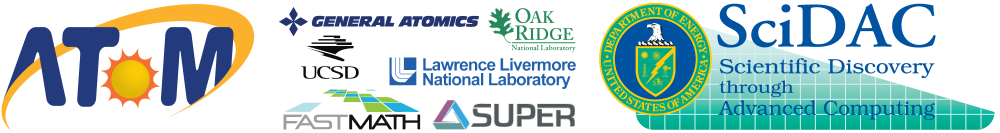

Advanced TOkamak Modeling project
---------------------------------

The goal of the AToM project is to enhance and extend predictive modeling capabilities that currently exist within the US magnetic fusion program.
We endeavour to support -- rather than subvert -- current workflows, build essential new infrastructure to address critical modeling gaps, and guide integration of high-performance computing resources to enable new physics capabilities.
The guiding philosophy of AToM is to take a bottom-up, collaborative approach that focuses on leveraging and integrating the wide spectrum of existing research activities throughout the US fusion community.
In this way, will take the US fusion program’s existing, mission-critical integrated modeling capabilities and make them even better.

The AToM project focuses on seven research thrusts:

1. Maintain OMFIT+IPS frameworks, provide wrappers and streamlining

2. Create simulation workflows for the core, pedestal and scrape-off-layer

3. Develop workflows for experimental validation

4. Accelerate COGENT integration into AToM with FASTMath

5. Carry out SUPER performance engineering of xGYRO/NEO

6. Establish a data management scheme, provenance and portal services

7. Provide user support and community outreach