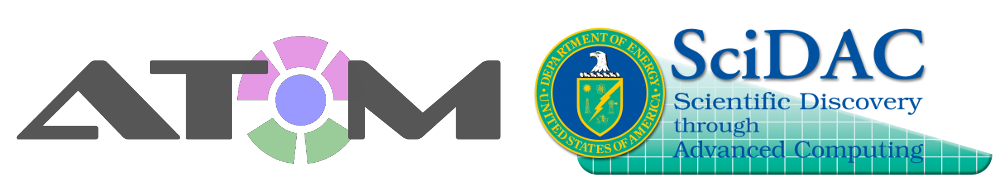

About AToM 
==========

A Brief Description of AToM 
---------------------------

The AToM project philosophy is to **enhance and extend present modeling capabilities by
leveraging and integrating existing research**.  AToM supports numerous physics codes,
frameworks, and tools which have been developed independently by the fusion community,
often through years or decades of research.  AToM seeks to streamline the integration of
these tools, to further their development, and to deploy and support the resulting software.

AToM Thrusts
------------

The goal of the AToM project is to support, integrate, and build upon a wide spectrum of existing 
research activities in the US fusion program, and guide the integration of high performance computing 
resources to enable a broad range of new physics capabilities.  A number of computational tools, 
including a workflow manager (`OMFIT <http://gafusion.github.io/OMFIT-source>`_), computational
framework (IPS), and high performance simulation 
codes (`GYRO/CGYRO, NEO, TGYRO, <http://gafusion.github.io/doc>`_ and COGENT) enable simulations
of complex plasma behavior, and extensive validation against experimental data.  AToM targets advanced
integrated simulations which couple core, pedestal and scrape-off-layer physics in order to predict,
and further optimize, performance of the fusion plasma.

The AToM project is divided into six thrusts:

1. Maintain OMFIT+IPS frameworks, provide wrappers and streamlining

2. Create simulation workflows for the core, pedestal and scrape-off-layer

3. Develop workflows for experimental validation

4. Accelerate COGENT integration into AToM with FASTMath

5. Carry out SUPER performance engineering of xGYRO/NEO

6. Establish a data management scheme, provenance and portal services

7. Provide user support and community outreach

.. toctree::
   :maxdepth: 2
   :caption: Navigation

   components
   find
   install
   literature
   mac_setup
   team
   tour
