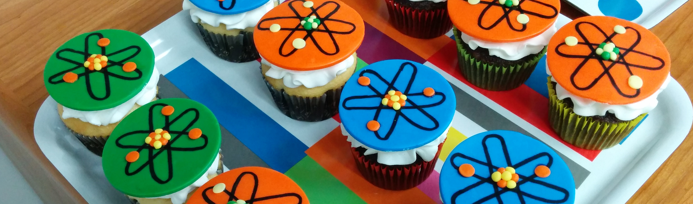

Meetings and AToM Team Members
==============================

2017.11.27 -- ESL/AToM All-hands Meeting and Code Camp 
~~~~~~~~~~~~~~~~~~~~~~~~~~~~~~~~~~~~~~~~~~~~~~~~~~~~~~

:Time:     Monday 27 Nov -- Thursday Nov 30 
:Location: General Atomics Bldg 7, Room G07-120
:Badges:   gonzalesl@fusion.gat.com
:Info:     `GA Visitor Information <http://www.ga.com/visitor-information>`_

------
AGENDA
------

+-----------------+-----------+--------------+-----------------------------------------+
| Day             | Time      |      Speaker | Title                                   |
+=================+===========+==============+=========================================+
| **Monday**      |      **ESL day**         |                                         |
+-----------------+-----------+--------------+-----------------------------------------+
|                 | 09:30AM   | Snyder/Candy | Welcome and logistics                   |
+-----------------+-----------+--------------+-----------------------------------------+
|                 | 09:45AM   | Snyder       | ESL project overview and timeline       |
+-----------------+-----------+--------------+-----------------------------------------+
|                 | 10:00PM   | Dorf         | COGENT progress and plans               |
+-----------------+-----------+--------------+-----------------------------------------+
|                 | 10:45PM   | **BREAK**    | [possible call with J. Mandrekas]       |
+-----------------+-----------+--------------+-----------------------------------------+
|                 | 10:55AM   | Candy        | CGYRO/NEO progress and plans            |
+-----------------+-----------+--------------+-----------------------------------------+
|                 | 11:40AM   |Krasheninnikov| UCSD progress and plans                 |
+-----------------+-----------+--------------+-----------------------------------------+
|                 | 12:00PM   |**DISCUSSION**| Physics coordination                    |
+-----------------+-----------+--------------+-----------------------------------------+
|                 | 12:15AM   | **LUNCH**                                              |
+-----------------+-----------+--------------+-----------------------------------------+
|                 | 01:30PM   | Dorr         | ESL math overview                       |
+-----------------+-----------+--------------+-----------------------------------------+
|                 | 02:30PM   | Ghosh        | Semi-implicit COGENT time-integration   |
+-----------------+-----------+--------------+-----------------------------------------+
|                 | 03:00PM   | Ricketson    | Sparse grid methods                     |
+-----------------+-----------+--------------+-----------------------------------------+
|                 | 03:30PM   | **BREAK**    |                                         |
+-----------------+-----------+--------------+-----------------------------------------+
|                 | 03:45AM   |**DISCUSSION**| Math and math/physics coordination      |
+-----------------+-----------+--------------+-----------------------------------------+
|                 | 04:00PM   | Candy        | AToM introduction, relation to ESL      |
+-----------------+-----------+--------------+-----------------------------------------+
|                 | 04:10PM   |Snyder/Meneg. | EPED and ESL-AToM coordination          |
+-----------------+-----------+--------------+-----------------------------------------+
|                 | 04:30PM   | Dorf/Dorr    | COGENT and ESL-AToM coordination        |
+-----------------+-----------+--------------+-----------------------------------------+
|                 | 05:00PM   |**DISCUSSION**| Joint AToM/ESL issues                   |
+-----------------+-----------+--------------+-----------------------------------------+
|                 | 07:00PM   |**DINNER**    | Location TBA                            |
+-----------------+-----------+--------------+-----------------------------------------+
| **Tuesday**     | **AToM Presentations**   |                                         |
+-----------------+-----------+--------------+-----------------------------------------+
|                 | 09:00AM   | Candy        | Welcome and AToM overview               |
+-----------------+-----------+--------------+-----------------------------------------+
|                 | 09:40AM   | Batchelor    | IPS for physics studies                 |
+-----------------+-----------+--------------+-----------------------------------------+
|                 | 10:00AM   | Holland      | Validation thrusts                      |
+-----------------+-----------+--------------+-----------------------------------------+
|                 | 10:20AM   | Green        | WDM thrust action items                 |
+-----------------+-----------+--------------+-----------------------------------------+
|                 | 10:40AM   | Bonoli       | AToM liaisons, SciDAC center interact.  |
+-----------------+-----------+--------------+-----------------------------------------+
|                 | 11:00AM   |**DISCUSSION**| Strategy for WDM, liaisons, integration |
+-----------------+-----------+--------------+-----------------------------------------+
|                 | 11:40AM   | **LUNCH**                                              |
+-----------------+-----------+--------------+-----------------------------------------+
|                 | 01:00PM   | Fann         | Parallel-in-time methods                |
+-----------------+-----------+--------------+-----------------------------------------+
|                 | 01:20PM   | Law          | Reduced Models                          |
+-----------------+-----------+--------------+-----------------------------------------+
|                 | 01:40PM   | Elwasif/Dorr | RAPIDS and FASTMath (ASCR SciDAC)       |
+-----------------+-----------+--------------+-----------------------------------------+
|                 | 02:00PM   | **BREAK**                                              |
+-----------------+-----------+--------------+-----------------------------------------+
|                 | 02:20PM   | Kessel       | Modeling activities at PPPL             |
+-----------------+-----------+--------------+-----------------------------------------+
|                 | 02:40PM   | Chen         | EP inteaction with MHD/turbulence       |
+-----------------+-----------+--------------+-----------------------------------------+
|                 | 03:00PM   | Dorf         | Modeling activities at LLNL             |
+-----------------+-----------+--------------+-----------------------------------------+
|                 | 03:20PM   | Park         | CESOL                                   |
+-----------------+-----------+--------------+-----------------------------------------+
|                 | 03:40PM   | **BREAK**                                              |
+-----------------+-----------+--------------+-----------------------------------------+
|                 | 04:00PM   |**DISCUSSION**| Create action items                     |
+-----------------+-----------+--------------+-----------------------------------------+
|                 | 07:00PM   |**DINNER**    | Location TBA                            |
+-----------------+-----------+--------------+-----------------------------------------+
| **Wednesday**   | **AToM Technical day**   |                                         |
+-----------------+-----------+--------------+-----------------------------------------+
|                 | 09:00AM   | Smith        | Logistics, Github navigation, etc       |
+-----------------+-----------+--------------+-----------------------------------------+
|                 | 09:25AM   | Elwasif      | IPS modules and development             |
+-----------------+-----------+--------------+-----------------------------------------+
|                 | 09:50AM   | Kalling      | My experience installing AToM           |
+-----------------+-----------+--------------+-----------------------------------------+
|                 | 10:15PM   | **BREAK**                                              |
+-----------------+-----------+--------------+-----------------------------------------+
|                 | 10:30AM   |**DISCUSSION**| Strategy for WDM, liaisons, integration |
+-----------------+-----------+--------------+-----------------------------------------+
|                 | 11:40AM   | **LUNCH**                                              |
+-----------------+-----------+--------------+-----------------------------------------+
|                 | 01:00PM   | Candy        | AToM makefile, Sphinx/rst, website tasks|
+-----------------+-----------+--------------+-----------------------------------------+
|                 | 01:30PM   | Meneghini    | AToM+ITER-IMAS = OMAS                   |
+-----------------+-----------+--------------+-----------------------------------------+
|                 | 02:00PM   | Snoep        | 1.5D STRAHL-TGYRO coupling              |
+-----------------+-----------+--------------+-----------------------------------------+
|                 | 07:00PM   |**DINNER**    | Location TBA                            |
+-----------------+-----------+--------------+-----------------------------------------+
| **Thursday**    | **AToM hackathon**       |                                         |
+-----------------+-----------+--------------+-----------------------------------------+
|                 | 09:00AM   |  **CODING**  | Questions and open discussion/coding    |
+-----------------+-----------+--------------+-----------------------------------------+
|                 | 11:40AM   | **LUNCH**                                              |
+-----------------+-----------+--------------+-----------------------------------------+
|                 | 01:30AM   |  **CODING**  | Questions and open discussion/coding    |
+-----------------+-----------+--------------+-----------------------------------------+
|                 | 07:00PM   |**DINNER**    | Location TBA                            |
+-----------------+-----------+--------------+-----------------------------------------+

2017.09.27 -- Kickoff Conference call 
~~~~~~~~~~~~~~~~~~~~~~~~~~~~~~~~~~~~~

:Time: Wednesday, 27 Sept 2017 -- 1:00pm-2:30pm PDT 
:Join: https://fusion.gat.com/global/Remote13-301

:Agenda:
#. Summary of AToM-0, vision for AToM (Candy, 10 min)
#. Self-introduction from each team member (all, 20 min)
#. Summary presentations by AToM-0 Institutional PIs 

   #. Bernholdt (6 min)
   #. Dorf (6 min)
   #. Dorr (6 min)
   #. Green (6 min)
   #. Holland (6 min)
   
#. Open discussion of action items for November F2F meeting at GA (30 min)

----

AToM Team (2017-present)
~~~~~~~~~~~~~~~~~~~~~~~~~~~~~~
.. _contact:

:Project PI:
 | **Jeff Candy**, General Atomics 
 | General Atomics, P.O. Box 85608
 | San Diego, CA 92186 
 |
 | Ph: 858-455-2593
 |
 | candy@fusion.gat.com

:FES PIs:
  | **David L. Green**, Oak Ridge National Laboratory
  | **Mikhail Dorf**, Lawrence Livermore National Laboratory
  | **Christopher Holland**, University of California, San Diego
  | **Charles Kessel**, Princeton Plasma Physics Laboratory

:ASCR PIs:
 | **David E. Bernholdt**, Oak Ridge National Laboratory
 | **Milo Dorr**, Lawrence Livermore National Laboratory
 | **David Schissel**, General Atomics

:Contractors:
 | **Paul Bonoli**, Massachusetts Institute of Technology
 | **Richard Kalling**, Kalling Software
 | **Yang Chen**, University of Colorado, Boulder
 | **Don Batchelor**, Oak Ridge National Laboratory

:Funded Collaborators:
 | **O. Meneghini**, General Atomics
 | **S.P. Smith**, General Atomics
 | **P.B. Snyder**, General Atomics
 | **D. Eldon**, General Atomics
 | **E. Belli**, General Atomics
 | **M. Kostuk**, General Atomics
 | **W. Elwasif**, Oak Ridge National Laboratory
 | **G. Fann**, Oak Ridge National Laboratory
 | **M. Cianciosa**, Oak Ridge National Laboratory
 | **J.M. Park**, Oak Ridge National Laboratory
 | **K. Law**, Oak Ridge National Laboratory
 | **M. Umansky** Lawerence Livermore National Laboratory
 | **A. Pankin** Lawerence Livermore National Laboratory
 | **D. Orlov**, University of California, San Diego
 | **N. Howard**, Massachusetts Institute of Technology
 | **J. Sachdev**, Princeton Plasma Physics Laboratory

----
 
Original AToM Team (2014-2017)
~~~~~~~~~~~~~~~~~~~~~~~~~~~~~~
.. _contact:

:Project PI:
 | **Jeff Candy**, General Atomics 
 | General Atomics, P.O. Box 85608
 | San Diego, CA 92186 
 |
 | Ph: 858-455-2593
 |
 | candy@fusion.gat.com

:FES PIs:
  | **David L. Green**, Oak Ridge National Laboratory
  | **Mikhail Dorf**, Lawrence Livermore National Laboratory
  | **Christopher Holland**, University of California, San Diego

:ASCR PIs:
 | **David E. Bernholdt**, Oak Ridge National Laboratory
 | **Milo Dorr**, Lawrence Livermore National Laboratory
 | **David Schissel**, General Atomics

:Funded Collaborators:
 | **O. Meneghini**, General Atomics, @orso82
 | **S. Smith**, General Atomics, @smithsp
 | **P.B. Snyder**, General Atomics
 | **W. Elwasif**, Oak Ridge National Laboratory
 | **E. D'Azevedo**, Oak Ridge National Laboratory
 | **J.M. Park**, Oak Ridge National Laboratory
 | **D. Batchelor**, Oak Ridge National Laboratory
 | **M. Umansky** Lawerence Livermore National Laboratory
 | **V. Izzo**, University of California, San Diego
 | **D. Orlov**, University of California, San Diego

 
