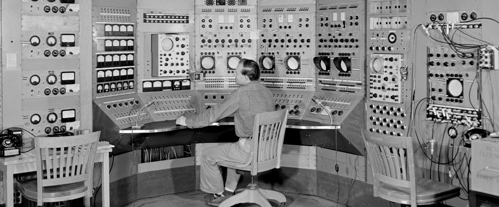

.. figure:: images/atom_cupcakes.jpg

Upcoming AToM Meetings
======================

AToM 2020: US Integrated Modeling in the ITER Era
~~~~~~~~~~~~~~~~~~~~~~~~~~~~~~~~~~~~~~~~~~~~~~~~~

Because of COVID-19 the original week-long AToM meeting will be remote and in a much condensed form.

:Time: Monday 30 March -- Tuesday 31 March 2020

:Location: Remote ZOOM meeting

----

:Monday March 30th:
   
.. toggle-header::
   :header: Agenda 
	    
      | **10:00am-noon:**
      | Update on AToM SciDAC Center Liaisons and Interactions (Bonoli / F1-F5, C7)
      | Update on RF IPS components for AToM (Batchelor / F1)
      | Plans to Use IPS-FASTRAN to explore FNSF/Pilot Plant configurations (Kessel / D1,D2)
      | Reconstructing SOLPS transport coefficents via IPS-quasi-Newton workflow (Cianciosa / C5)
      | ML techniques for improving the TGLF saturation rule (Neiser / B10)
      | Ultra-fast procedure for learning the TGLF Discontinuous Function (Etienam / B10)
      | Update on multiscale gyrokinetic simulation and comparison with experiment (Howard / D5)
      | Adaptive high-order time-stepping in CGYRO (Fann / A2)
      | CGYRO database (Candy / E2)
      | TRANSP Update (Sachdev / D1,D2)
      |
      | **LUNCH**
      |
      | **1:00pm-3:00pm:** 
      | LLNL progress report (Dorf / D6,F5)
      | Interaction of low-n EP-driven modes and microturbulence (Chen / D4)
      | Planning and analyzing plasma control with OMFIT (Eldon / A8)
      | EP tools for integrated modeling (Bass / D4)
      | Improved TGLF performance in L-mode edge (Staebler / B10)
      | V&V of turbulence and transport models for reactor scenarios (Holland / C4)
      | Role of electrons in gyrokinetic edge transport (Belli / C4,D5)
      | Starting the STEP workflow from 0D tokamak quantities in OMFIT (Slendebroek)
      | OMFIT development workflow (Kalling / A3)
      | CESOL progress (Park / B4,B5,B6)
      | IPS-FASTRAN progress (Kim / B1)
      | Progress Towards Standardized Synthetic Diagnostic Package (Pankin)
      | Scalable Data & Metadata Capture for AToM (Kostuk / E1,E2)
      | 
      | **3:30pm-4:00pm**
      | Recap and open discussion (Candy)

----

:Tuesday March 31st:

.. toggle-header::
   :header: Agenda
	    
      | **10:00am-noon:** 
      | Communication and community coding (Smith / A3,A4,A6)
      | Use-Case breakout discussion (Holland)
      |
      | **LUNCH**
      |
      | **1:00pm-3:00pm:** ITER IM
      | **3:00pm-4:00pm:** wrap-up

----

Past Meetings
=============

List of :ref:`past_meetings`

----

AToM Team
=========

2017-present
~~~~~~~~~~~~

:Project PI:
 | **Jeff Candy**, `@jcandy <https://github.com/jcandy>`_
 | General Atomics, P.O. Box 85608
 | San Diego, CA 92186 
 |
 | Ph: 858-455-2593
 |
 | candy@fusion.gat.com

:FES PIs:
  | **David L. Green**, Oak Ridge National Laboratory, @dlg0
  | **Mikhail Dorf**, Lawrence Livermore National Laboratory
  | **Christopher Holland**, University of California, San Diego
  | **Charles Kessel**, Princeton Plasma Physics Laboratory

:ASCR PIs:
 | **David E. Bernholdt**, Oak Ridge National Laboratory
 | **Milo Dorr**, Lawrence Livermore National Laboratory
 | **David Schissel**, General Atomics

:Contractors:
 | **Paul Bonoli**, Massachusetts Institute of Technology
 | **Richard Kalling**, Kalling Software, `@kalling <https://github.com/kalling>`_
 | **Yang Chen**, University of Colorado, Boulder
 | **Don Batchelor**, Oak Ridge National Laboratory

:Funded Collaborators:
 | **O. Meneghini**, General Atomics, @orso82
 | **S.P. Smith**, General Atomics, @smithsp
 | **P.B. Snyder**, General Atomics
 | **D. Eldon**, General Atomics @eldond
 | **E. Belli**, General Atomics
 | **M. Kostuk**, General Atomics, @kostukm
 | **W. Elwasif**, Oak Ridge National Laboratory, `@elwasif <https://github.com/elwasif>`_
 | **G. Fann**, Oak Ridge National Laboratory
 | **M. Cianciosa**, Oak Ridge National Laboratory, `@cianciosa <https://github.com/cianciosa>`_
 | **J.M. Park**, Oak Ridge National Laboratory
 | **K. Law**, Oak Ridge National Laboratory, @klaw1980
 | **M. Umansky** Lawerence Livermore National Laboratory
 | **A. Pankin** Lawerence Livermore National Laboratory, @pankin
 | **D. Orlov**, University of California, San Diego
 | **N. Howard**, Massachusetts Institute of Technology
 | **J. Sachdev**, Princeton Plasma Physics Laboratory, @jsachdev

----
 
2014-2017
~~~~~~~~~

:Project PI:
 | **Jeff Candy**, General Atomics 
 | General Atomics, P.O. Box 85608
 | San Diego, CA 92186 
 |
 | Ph: 858-455-2593
 |
 | candy@fusion.gat.com

:FES PIs:
  | **David L. Green**, Oak Ridge National Laboratory, @dlg0
  | **Mikhail Dorf**, Lawrence Livermore National Laboratory
  | **Christopher Holland**, University of California, San Diego

:ASCR PIs:
 | **David E. Bernholdt**, Oak Ridge National Laboratory
 | **Milo Dorr**, Lawrence Livermore National Laboratory
 | **David Schissel**, General Atomics

:Funded Collaborators:
 | **O. Meneghini**, General Atomics, @orso82
 | **S. Smith**, General Atomics, @smithsp
 | **P.B. Snyder**, General Atomics
 | **W. Elwasif**, Oak Ridge National Laboratory, `@elwasif <https://github.com/elwasif>`_
 | **E. D'Azevedo**, Oak Ridge National Laboratory
 | **J.M. Park**, Oak Ridge National Laboratory
 | **D. Batchelor**, Oak Ridge National Laboratory
 | **M. Umansky** Lawerence Livermore National Laboratory
 | **V. Izzo**, University of California, San Diego
 | **D. Orlov**, University of California, San Diego

 
