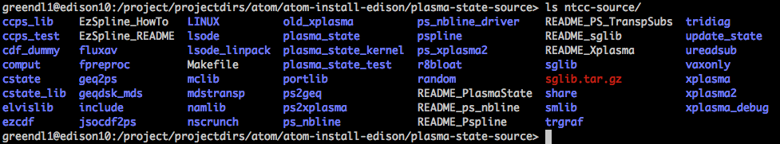

plasma-state build notes
========================

http://w3.pppl.gov/ntcc/PlasmaState

Requires: pspline, TranspSubs, Xplasma, sglib (all these are in ntcc-source)
There seem to be both t\_ versions and regular versions. Looks like the t\_ versions are related to SWIM, so we will use those. Be nice if someone documented what the difference was.

Looks like you simply put the contents of the downloaded source into the same directory and run the gmake command since all the top-level Makefiles are the same.

Edison GNU
~~~~~~~~~~

.. code-block :: bash

   module swap PrgEnv-intel PrgEnv-gnu
   module swap gcc gcc/4.8.2 # This is because there is no netcdf built for gcc49
   module load netcdf
   cd /project/projectdirs/atom/atom-install-edison/plasma-state-source/ntcc-source
   NTCC_DIR=/project/projectdirs/atom/atom-install-edison/plasma-state-source/ntcc-gnu
   make realclean
   FC="ftn" CC="cc" CXX="CC" FORTRAN_VARIANT="GCC" gmake NO_EDITLIBS=Y LAPACK="" BLAS=""
   gmake install PREFIX=$NTCC_DIR

A lot of the test routines seem to fail building with the following error

::

   /opt/cray/hdf5/1.8.13/GNU/48/lib/libhdf5.a(H5PL.o): In function `H5PL_load': H5PL.c:(.text+0x4ac): warning: Using 'dlopen' in statically linked applications requires at runtime the shared libraries from the glibc version used for linking
   /usr/bin/ld: link errors found, deleting executable `../LINUX/test/update_state'
   collect2: error: ld returned 1 exit status
   gmake[1]: *** [../LINUX/test/update_state] Error 1

But it seems OK not to worry about that.

